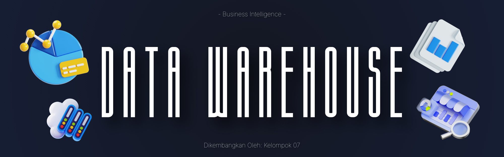
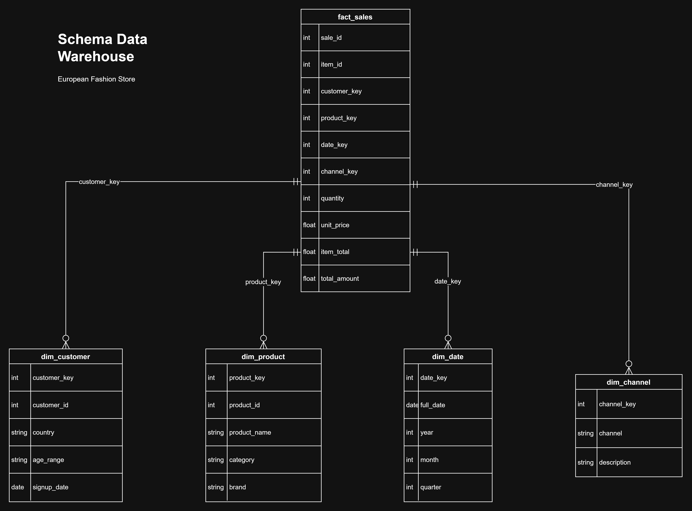

<a name="top"></a>

<div align="center">
  
</div>

<p align="center">
  
  
  
  
</p>

<h1 align="center">Data Warehouse: European Fashion Store</h1>
<p align="center">
  <i>Proyek UTS Mata Kuliah Business Intelligence — ETL & Star Schema</i>
</p>

<p align="center">
  <a href="https://colab.research.google.com/drive/1CGMfDZrWjQG0U6nqavsL6oAuKqOZPkZD?usp=sharing">
    
  </a>
  <a href="https://github.com/ariscandra/bi-uts-dw-european-fashion-store">
    
  </a>
  <a href="https://www.kaggle.com/datasets/joycemara/european-fashion-store-multitable-dataset">
    
  </a>
</p>

---

## 📚 Daftar Isi

- [Data Warehouse: European Fashion Store](#data-warehouse-european-fashion-store)
  - [📚 Daftar Isi](#-daftar-isi)
  - [📋 Deskripsi Proyek](#-deskripsi-proyek)
  - [👥 Profil Kelompok](#-profil-kelompok)
  - [🛠 Tech Stack](#-tech-stack)
  - [📊 Dataset](#-dataset)
  - [🏗 Arsitektur Data Warehouse](#-arsitektur-data-warehouse)
  - [⚙️ Proses ETL](#️-proses-etl)
  - [📁 Struktur Repo](#-struktur-repo)
  - [🔗 Link Penting](#-link-penting)
  - [🚀 Cara Menjalankan](#-cara-menjalankan)
  - [📄 Laporan](#-laporan)

---

## 🔗 Link Penting

| Link | Deskripsi |
|------|-----------|
| [**Google Colab**](https://colab.research.google.com/drive/1CGMfDZrWjQG0U6nqavsL6oAuKqOZPkZD?usp=sharing) | Notebook ETL siap dijalankan (tanpa perlu clone) |
| [**GitHub Repo**](https://github.com/ariscandra/bi-uts-dw-european-fashion-store) | Repositori proyek |
| [**Kaggle Dataset**](https://www.kaggle.com/datasets/joycemara/european-fashion-store-multitable-dataset) | European Fashion Store (Multitable E-Commerce) |

---

## 📋 Deskripsi Proyek

<p align="justify">Proyek ini mendemonstrasikan pembangunan <strong>data warehouse</strong> menggunakan dataset <strong>European Fashion Store (Multitable E-Commerce)</strong> dari Kaggle. Fokus utama meliputi proses <strong>ETL</strong> (Extract, Transform, Load), pemodelan dimensional dengan <strong>star schema</strong>, serta persiapan data siap analisis untuk mendukung keputusan bisnis.</p>

### Tujuan

<p>
  
  
  
</p>

| Tujuan | Keterangan |
|--------|------------|
| Membangun data warehouse | Star schema dari data European Fashion Store |
| Menerapkan ETL lengkap | Extract, Transform, Load dengan Python/pandas |
| Analisis bisnis | Insight penjualan per channel, negara, kategori, tren bulanan |

---

## 👥 Profil Kelompok

| Nama | NIM | Kelas |
|------|-----|-------|
| Muhammad Fakhri Al-Kautsar | 2409116081 | Sistem Informasi C '24 |
| Raihan Fariz Novanto | 2409116083 | Sistem Informasi C '24 |
| Aris Candra Muzaffar | 2409116088 | Sistem Informasi C '24 |
| Jabbar Hafizh Abdillah | 2409116116 | Sistem Informasi C '24 |

---

## 🛠 Tech Stack

<p>
  
  
  
</p>

| Komponen | Teknologi |
|----------|-----------|
| **Bahasa** | Python 3 |
| **Library** | pandas |
| **Environment** | Google Colab |
| **Arsitektur** | Star Schema |
| **Sumber Data** | 7 file CSV (Kaggle) |

---

## 📊 Dataset

**European Fashion Store (Multitable E-Commerce)** — [Kaggle Dataset](https://www.kaggle.com/datasets/joycemara/european-fashion-store-multitable-dataset)

<p align="center">
  <a href="https://www.kaggle.com/datasets/joycemara/european-fashion-store-multitable-dataset">
    
  </a>
</p>

| File | Deskripsi |
|------|-----------|
| `dataset_fashion_store_sales.csv` | Transaksi penjualan |
| `dataset_fashion_store_salesitems.csv` | Detail item per transaksi |
| `dataset_fashion_store_customers.csv` | Data pelanggan |
| `dataset_fashion_store_products.csv` | Katalog produk |
| `dataset_fashion_store_channels.csv` | Channel penjualan (E-commerce, App Mobile) |
| `dataset_fashion_store_campaigns.csv` | Data kampanye |
| `dataset_fashion_store_stock.csv` | Data stok |

<details>
<summary><b>Detail struktur dataset</b></summary>

- **Sales:** sale_id, channel, discounted, total_amount, sale_date, customer_id, country
- **Sales Items:** sale_id, product_id, quantity, item_total, dll.
- **Customers:** customer_id, first_name, last_name, birth_date
- **Products:** product_id, name, category, price, dll.
- **Channels:** channel_id, channel_name (E-commerce, App Mobile)

</details>

---

## 🏗 Arsitektur Data Warehouse

### Star Schema

Proyek ini menggunakan desain **star schema** dengan satu tabel fakta dan empat tabel dimensi:

<div align="center">
  
</div>

| Tabel | Tipe | Deskripsi |
|-------|------|-----------|
| `fact_sales` | Fact | Transaksi penjualan (revenue, quantity, dll.) |
| `dim_customer` | Dimension | Pelanggan (usia, negara, rentang usia) |
| `dim_product` | Dimension | Produk (kategori, nama, harga) |
| `dim_date` | Dimension | Tanggal (tahun, bulan, hari) |
| `dim_channel` | Dimension | Channel (E-commerce, App Mobile) |

<details>
<summary><b>Detail relasi tabel</b></summary>

- `fact_sales` → `dim_customer` via `customer_key`
- `fact_sales` → `dim_product` via `product_key`
- `fact_sales` → `dim_date` via `date_key`
- `fact_sales` → `dim_channel` via `channel_key`

</details>

---

## ⚙️ Proses ETL

<details>
<summary><b>1. Extract — Membaca data sumber</b></summary>

- Membaca 7 file CSV dari folder `dataset/`
- Memuat ke DataFrame pandas
- Pengecekan struktur dan tipe data

</details>

<details>
<summary><b>2. Transform — Membersihkan & memodelkan</b></summary>

| Output | Proses |
|--------|--------|
| **dim_customer** | Gabung customers + agregasi dari sales (country, age_range) |
| **dim_product** | Dari products (product_key, category, name, price) |
| **dim_date** | Generate dari rentang tanggal unik (year, month, day) |
| **dim_channel** | Dari channels (channel_key, channel_name) |
| **fact_sales** | Join sales + sales_items + customers + products + channels; agregasi item_total, quantity |

</details>

<details>
<summary><b>3. Load — Menyimpan ke data warehouse</b></summary>

- Menyimpan 5 file CSV ke folder `data_warehouse/`
- Validasi jumlah baris dan integritas referensi

</details>

---

## 📁 Struktur Repo

<details>
<summary><b>Lihat struktur folder</b></summary>

```
bi-uts-dw-european-fashion-store/
├── README.md
├── dataset/                     # 7 CSV sumber
│   ├── dataset_fashion_store_sales.csv
│   ├── dataset_fashion_store_salesitems.csv
│   ├── dataset_fashion_store_customers.csv
│   ├── dataset_fashion_store_products.csv
│   ├── dataset_fashion_store_channels.csv
│   ├── dataset_fashion_store_campaigns.csv
│   └── dataset_fashion_store_stock.csv
├── etl/
│   └── ETL_Fashion_Store.ipynb  # Notebook ETL (Google Colab)
├── data_warehouse/              # Output star schema
│   ├── dim_customer.csv
│   ├── dim_product.csv
│   ├── dim_date.csv
│   ├── dim_channel.csv
│   └── fact_sales.csv
├── laporan/                     # Laporan UTS
│   ├── Laporan Business Intelligence_Kelompok 7.docx
│   └── grafik/
└── docs/                        # Aset README
    ├── poster.png
    └── schema_dw.jpg
```

</details>

---

## 🚀 Cara Menjalankan

<details>
<summary><b>Prasyarat</b></summary>

- Akun Google (untuk Colab)
- Akses internet
- Repo ini sudah berisi dataset di folder `dataset/`

</details>

1. **Buka notebook di Google Colab** (paling mudah)
   - **[▶️ Buka di Colab](https://colab.research.google.com/drive/1CGMfDZrWjQG0U6nqavsL6oAuKqOZPkZD?usp=sharing)** — notebook sudah berisi dataset dari repo
   - Alternatif: buka [ETL_Fashion_Store.ipynb](etl/ETL_Fashion_Store.ipynb) di GitHub lalu klik "Open in Colab"

2. **Clone repo ke Colab** (jika menjalankan dari notebook kosong)
   ```python
   !git clone https://github.com/ariscandra/bi-uts-dw-european-fashion-store.git
   ```

3. **Jalankan semua cell**
   - Notebook akan membaca dari `dataset/` dan menulis output ke `data_warehouse/`
   - Path default: `/content/bi-uts-dw-european-fashion-store/dataset`

4. **Download output** (opsional)
   - File CSV di `data_warehouse/` dapat di-download dari Colab Files

---

## 📄 Laporan

Laporan UTS tersedia di folder `laporan/` dalam format Word (.docx) beserta grafik analisis.

---

<p align="center">
  <sub>UTS Business Intelligence — Data Warehouse</sub>
</p>

<p align="center">
  <a href="#top">⬆️ Kembali ke Atas</a>
</p>
